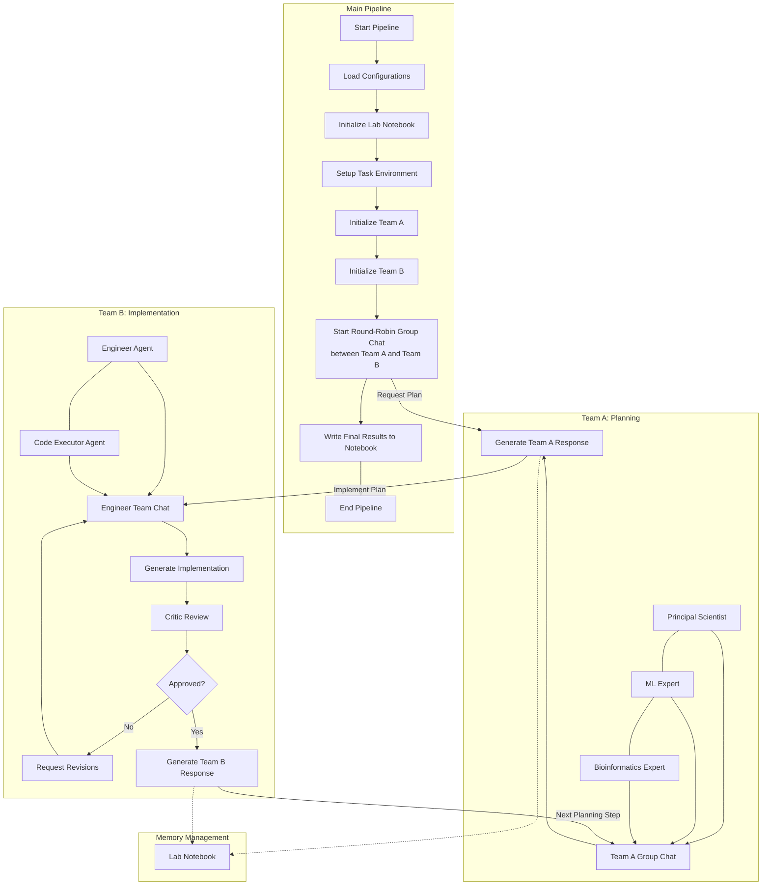

```mermaid
graph TD
    subgraph "Main Pipeline"
        Start[Start Pipeline] --> LoadConfig[Load Configurations]
        LoadConfig --> InitNotebook[Initialize Lab Notebook]
        InitNotebook --> SetupEnv[Setup Task Environment]
        SetupEnv --> InitA[Initialize Team A]
        InitA --> InitB[Initialize Team B]
        InitB --> MainGroupChat[Start Round-Robin Group Chat<br>between Team A and Team B]
        MainGroupChat --> WriteResults[Write Final Results to Notebook]
        WriteResults --> End[End Pipeline]
    end

    subgraph "Team A: Planning"
        PrincipalSci[Principal Scientist] --- MLExpert[ML Expert]
        MLExpert --- BioExpert[Bioinformatics Expert]
        PrincipalSci --> TeamAChat[Team A Group Chat]
        MLExpert --> TeamAChat
        BioExpert --> TeamAChat
        TeamAChat --> TeamAResponse[Generate Team A Response]
    end

    subgraph "Team B: Implementation"
        Engineer[Engineer Agent] --- CodeExecutor[Code Executor Agent]
        Engineer --> EngineerTeam[Engineer Team Chat]
        CodeExecutor --> EngineerTeam
        EngineerTeam --> EngineerOutput[Generate Implementation]
        EngineerOutput --> CriticTeam[Critic Review]
        CriticTeam --> CriticDecision{Approved?}
        CriticDecision -->|No| RevisionRequest[Request Revisions]
        RevisionRequest --> EngineerTeam
        CriticDecision -->|Yes| TeamBResponse[Generate Team B Response]
    end

    MainGroupChat -->|Request Plan| TeamAResponse
    TeamAResponse -->|Implement Plan| EngineerTeam
    TeamBResponse -->|Next Planning Step| TeamAChat

    subgraph "Memory Management"
        Notebook[Lab Notebook]
        TeamAResponse -.-> Notebook
        TeamBResponse -.-> Notebook
    end
``` 